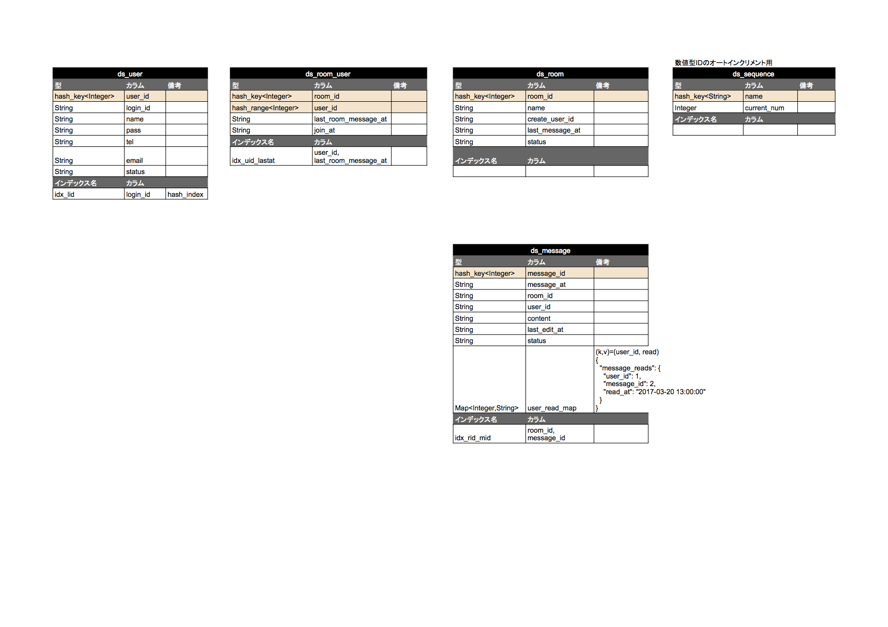

ddd_server
===============
spring4.0

### ddd(クリーンアーキテクチャ)検証  
* 認証などの実装が省かれています。
* dynamodb.propertiesはgitignoreに追加しているため、clone時はローカルに用意する必要があります。
  （dynamodb.propetiesは外部公開できないため）　

### ddd検証

* トランザクション等細かい処理は簡略しています。
* RDS,DynamoDBのer図は下記を参照

■RDS - ER図

■DynamoDB - ER図
